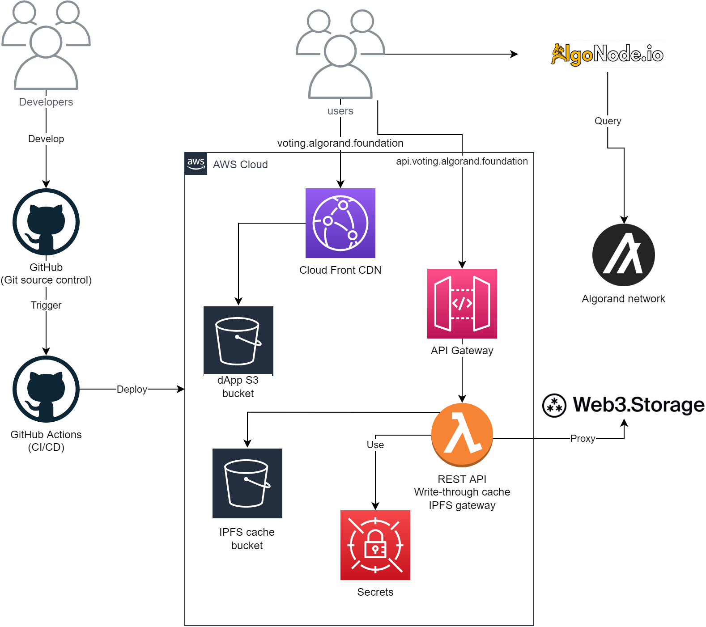
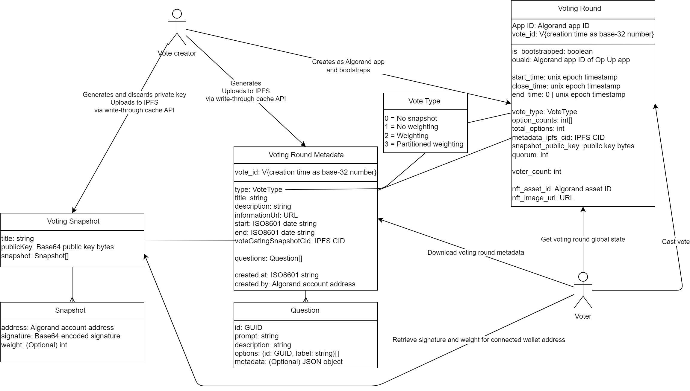
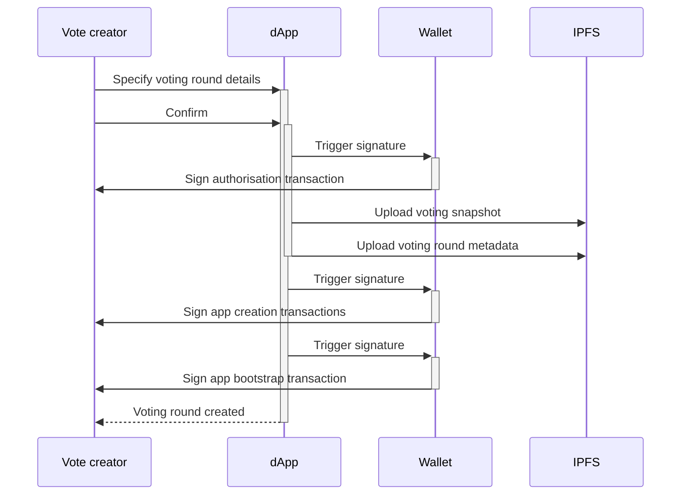
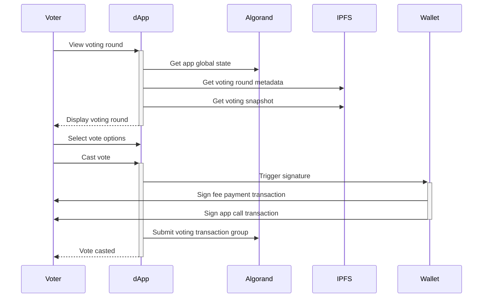

# On-chain Voting Tool

This repository contains a voting tool that allows for creation and facilitation of immutable, tamperproof voting using the Algorand blockchain.

## Background

The Algorand Foundation aims to establish a long term, mutually beneficial relationship with the Algorand NFT ecosystem, stakeholders and community through a series of initiatives to advance the utility and support the growth of the Algorand NFT ecosystem by establishing an NFT Council. A required capability for the establishment is an on-chain voting tool to facilitate transparent community decision making. As such, this Open Source project was created to facilitate the creation of this voting tool as well as provide a general purpose on-chain voting capability to the wider ecosystem.

## Components

The design for this voting tool has been [documented as an Architecture Decision Record](./docs/architecture-decisions/2023-03-02_voting-design.md).

This project contains a number of components:

* [Write-through cache Algorand IPFS gateway](./src/voting-metadata-api/README.md)
* [Voting dApp](./src/dapp/README.md)
* [xGov dApp](./src/xgov-dapp/README.md)
* [Voting smart contract](./src/algorand/README.md)
* [AWS CDK Infrastructure as Code](./infrastructure/README.md)
* [GitHub Actions CI/CD pipeline](./.github)



## Flow

### Entities



### Voting round creation



### Voting




## Development setup
To run the application locally you need 3 components running:

* An [Algorand LocalNet](https://github.com/algorandfoundation/algokit-cli/blob/main/docs/features/localnet.md)
* The [Write-through cache Algorand IPFS gateway](./src/voting-metadata-api/README.md)
* The [Voting dApp](./src/dapp/README.md)

### Pre-requisites

1. Install `AlgoKit` - [Link](https://github.com/algorandfoundation/algokit-cli#install); ensure you can execute `algokit --version`.
2. Install Node.js / npm

### First-time setup

1. Initialise the projects, which you can do by either:
    * `algokit bootstrap all` in `src/`, or:
    * Manually do it by running `npm install` and then copying `.env.template` to `.env` in `src/dapp` and `src/voting-metadata-api`
2. Run the projects, which you can do by either:
    * Opening the project in VS Code and running the `Run All` Run and Debug configuration
    * Run `algokit localnet start` to start a LocalNet network and run `npm run dev` in `src/dapp` and `src/voting-metadata-api`
3. Visit the dApp at <http://localhost:5173/>

After completing these steps, you should have all three components running locally, and you can test the application.

### Subsequent setup

You can follow step 2 above.

### Editing the smart contract

If you want to change the smart contract then you can set up the smart contract development environment by:

1. Executing `algokit bootstrap all` in `src/algorand`
2. Editing `src/algorand/smart_contracts/voting.py` to change the smart contract and `src/algorand/smart_contracts/deploy-config.ts` to change the local test deployment harness and `src/algorand/smart_contracts/tests/voting.spec.ts` to change the automated tests
3. Build the smart contract by either executing `python -m smart_contracts build` in the `src/algorand` folder or running the VS Code `Build Beaker application` task
4. Ensure the smart contract can be deployed and executed in its happy path by either executing `npm run deploy` in the `src/algorand/smart_contracts` folder or running the VS Code `Deploy built beaker application` Run and Debug configuration
4. Run the automated tests by either executing `npm run test` in the `src/algorand/smart_contracts` folder or running tests using the VS Code Testing pane

## Deployment

This solution has automated Continuous Integration and Continuous Delivery support using GitHub Actions, including Infrastructure as Code automation for AWS. This means, you can fully automate the build and multi-environment deployment of this solution without manual steps once you have configured the GitHub Actions secrets and variables.

The deployment pipeline can be [found in](./.github) the `.github` folder.

To use it you need to configure the following with a `DEV_` prefix for TestNet and `PROD_` prefix for MainNet.

* Secrets
    * `AWS_ACCESS_KEY_ID`: The access key of a "deployment user" in AWS with requisite access (see below)
    * `AWS_ACCESS_KEY_SECRET`: The secret of the deployment user
    * `CDK_DEFAULT_ACCOUNT`: The ID of the AWS account being deployed to
    * `WEB3_STORAGE_API_TOKEN`: An API token from a <https://web3.storage/> account
    * `ALGOD_NODE_CONFIG_TOKEN`: (Optional) Token for the algod API if needed
* Variables
    * `ALGOD_NETWORK`: The Algorand network name, either `testnet` or `mainnet`
    * `ALGOD_NODE_CONFIG_PORT`: Likely `443`
    * `ALGOD_NODE_CONFIG_SERVER`: e.g. `https://testnet-api.algonode.cloud/` or `https://mainnet-api.algonode.cloud/` etc.
    * `ENVIRONMENT`: `dev` or `prod`
    * `INDEXER_PORT`: Likely `443`
    * `INDEXER_SERVER`: e.g. `https://testnet-idx.algonode.cloud/` or `https://mainnet-idx.algonode.cloud/` etc.
    * `IPFS_GATEWAY_URL`: The URL to the IPFS gateway that is deployed as part of this solution including the `/ipfs` e.g. `https://api.testnet.voting.algorand.foundation/ipfs`
    * `ALGO_EXPLORER_URL`: The URL to AlgoExplorer e.g. `ALGO_EXPLORER_URL`
    * `NFT_EXPLORER_URL`: The URL to NFT Explorer for an asset, minus the asset ID e.g. `https://nftexplorer.app/asset/`
    * `IS_TESTNET`: `true` or `false`
    * `CREATOR_ALLOW_LIST_ADDRESSES`: The allowlist for voting round creators. To keep it open for anyone set it to `any`. Alternatively you can limit access to an allowist of addresses e.g. `MOIL6NTBHUFAWV5TYY6YYRJ2N3LOAPOBEV4ZPFZAJKZX3OHGQVMYLEHEUU,ODTX32FQL44D5GIJ2CMCEZ4G3FGUU3WUYDHJZDRNSSLHDO54ESGKXC25UQ`

### DNS

The first time you deploy to a given environment, it will reach a point in the `dns-web` stack where it's waiting for the certificate validation. This is happening because it needs DNS to be delegated to the Route 53 instance that has been provisioned.

To do that you need to log into the AWS console, find the new Route 53 instance, see the NS records that are defined in it by default and add them to your source DNS. Note: this means you will be delegating that entire (sub-)domain to AWS to manage. If you don't want to do that, the alternative option is to manually create the validation CName that you will see in Route 53 and then create the other CName records that appear for the dApp and API.

### Least privilege AWS access

We recommend using the following IAM policy, which gives the least access possible to the deployment user to perform the deployment of infrastructure. You just need to replace `{region}` with the name of the region you are deploying into and `{account}` with the ID of the account you are deploying into.

```json
{
    "Version": "2012-10-17",
    "Statement": [
        {
            "Sid": "ECRPolicy",
            "Effect": "Allow",
            "Action": [
                "ecr:CreateRepository",
                "ecr:DeleteRepository",
                "ecr:DescribeRepositories",
                "ecr:GetLifecyclePolicy",
                "ecr:GetRepositoryPolicy",
                "ecr:ListTagsForResource",
                "ecr:SetRepositoryPolicy",
                "ecr:PutImageTagMutability",
                "ecr:PutImageScanningConfiguration"
            ],
            "Resource": [
                "arn:aws:ecr:{region}:{account}:repository/*",
                "arn:aws:ecr:us-east-1:{account}:repository/*"
            ]
        },
        {
            "Sid": "IAMPolicy",
            "Effect": "Allow",
            "Action": [
                "iam:AttachRolePolicy",
                "iam:CreateRole",
                "iam:DeleteRole",
                "iam:DeleteRolePolicy",
                "iam:DetachRolePolicy",
                "iam:GetRole",
                "iam:GetRolePolicy",
                "iam:PutRolePolicy"
            ],
            "Resource": [
                "arn:aws:iam::{account}:role/*"
            ]
        },
        {
            "Sid": "KMSPolicy",
            "Effect": "Allow",
            "Action": [
                "kms:GenerateDataKey"
            ],
            "Resource": [
                "arn:aws:kms:{region}:{account}:key/*",
                "arn:aws:kms:us-east-1:{account}:key/*"
            ]
        },
        {
            "Sid": "S3Policy",
            "Effect": "Allow",
            "Action": [
                "s3:CreateBucket",
                "s3:DeleteBucketPolicy",
                "s3:GetBucketPolicy",
                "s3:PutBucketPublicAccessBlock",
                "s3:PutBucketPolicy",
                "s3:PutBucketVersioning",
                "s3:PutEncryptionConfiguration",
                "s3:ListAllMyBuckets"
            ],
            "Resource": [
                "arn:aws:s3:::*"
            ]
        },
        {
            "Sid": "STSPolicy",
            "Effect": "Allow",
            "Action": [
                "sts:AssumeRole"
            ],
            "Resource": [
                "arn:aws:iam::{account}:role/*"
            ]
        },
        {
            "Sid": "SecretsManagerPolicy",
            "Effect": "Allow",
            "Action": [
                "secretsmanager:PutSecretValue"
            ],
            "Resource": [
                "arn:aws:secretsmanager:{region}:{account}:secret:*"
            ]
        },
        {
            "Sid": "SSMPolicy",
            "Effect": "Allow",
            "Action": [
                "ssm:DeleteParameter",
                "ssm:PutParameter",
                "ssm:GetParameters",
                "ssm:GetParameter"
            ],
            "Resource": [
                "arn:aws:ssm:{region}:{account}:parameter/*",
                "arn:aws:ssm:us-east-1:{account}:parameter/*"
            ]
        },
        {
            "Sid": "CloudformationPolicy",
            "Effect": "Allow",
            "Action": [
                "cloudformation:CreateChangeSet",
                "cloudformation:DescribeChangeSet",
                "cloudformation:DescribeStacks",
                "cloudformation:DescribeStackEvents",
                "cloudformation:DeleteChangeSet",
                "cloudformation:DeleteStack",
                "cloudformation:ExecuteChangeSet",
                "cloudformation:GetTemplate"
            ],
            "Resource": [
                "arn:aws:cloudformation:{region}:{account}:stack/*/*",
                "arn:aws:cloudformation:us-east-1:{account}:stack/*/*"
            ]
        }
    ]
}
```
