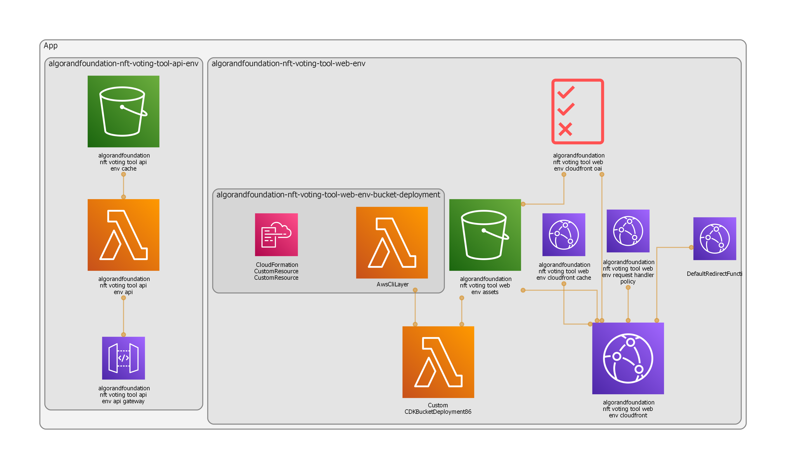

# AWS CDK Infrastructure as Code

The `cdk.json` file tells the CDK Toolkit how to execute your app.

- `.bin` contains the entry point that orchestrates everything
- `lib` contains the stacks
- `test` contains tests

## Logical architecture

## Physical architecture

## Getting started

1. Open repository in VS Code
2. Install recommended extensions
3. Install graphviz
4. Copy `.env.template` to `.env` and fill in the values
5. Ensure the "Run and Debug" configuration in VS Code is set to "Deploy AWS" and hit F5

## Generating physical architecture diagram

Ensure the "Run and Debug" configuration in VS Code is set to "Generate AWS Diagram" and hit F5

## Useful commands

- `npm run build` compile typescript to js
- `npm run watch` watch for changes and compile
- `npm run test` perform the jest unit tests
- `cdk deploy` deploy this stack to your default AWS account/region
- `cdk diff` compare deployed stack with current state
- `cdk synth` emits the synthesized CloudFormation template
